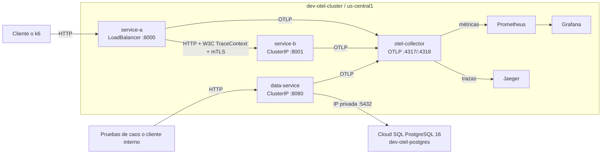
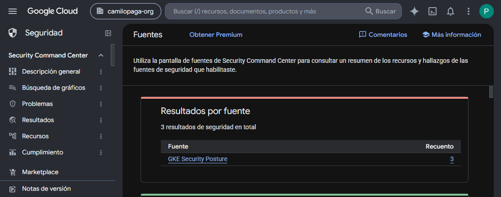
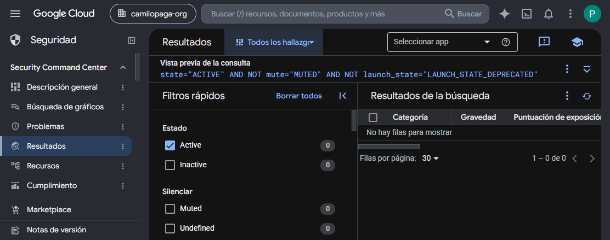

# Observabilidad End-to-End en GKE con OpenTelemetry

Laboratorio de observabilidad para tres servicios FastAPI desplegados en GKE. Centraliza trazas, métricas y logs con OpenTelemetry, Jaeger, Prometheus, Grafana y Cloud Logging; `data-service` usa Cloud SQL PostgreSQL por red privada para los experimentos de datos, caos y detección de anomalías. El alcance de este repositorio es GCP-only; no contiene ni declara componentes AWS.

## Estado verificado

| Recurso | Estado |
|---|---|
| Proyecto GCP | `project-546ee9f1-20e7-4368-919` |
| Región | `us-central1` |
| GKE | `dev-otel-cluster`, `v1.35.7-gke.1027000` |
| Cloud SQL | PostgreSQL 16, `dev-otel-postgres`, IP privada `10.40.0.2` |
| Observabilidad | OTel Collector, Jaeger, Prometheus y Grafana desplegados |
| Seguridad | VPC Flow Logs, métricas de autenticación, reglas y dashboard desplegados |
| Cloud Service Mesh | Gestionado, `ACTIVE` con Traffic Director; sidecars Envoy, mTLS y telemetría L7 validados |
| Security Command Center | SCC Standard activo; consulta v2 validada sin hallazgos activos |

## Arquitectura actual



`service-a` consume `service-b` y propaga `traceparent`. `data-service` es un servicio independiente: recibe tráfico de las pruebas de datos y experimentos, y es el único componente de esta topología que accede a Cloud SQL. Los nombres DNS, no los ClusterIP, son la referencia estable.

| Namespace | Servicio | Endpoint | Función |
|---|---|---|---|
| `services` | `service-a` | [http://35.193.118.242:8000/docs](http://35.193.118.242:8000/docs) | API de órdenes |
| `services` | `service-b` | `service-b.services.svc.cluster.local:8001` | Catálogo |
| `services` | `data-service-data-service` | `data-service-data-service.services.svc.cluster.local:8080` | Datos, AIOps y seguridad |
| `observability` | `otel-collector` | `otel-collector.observability.svc.cluster.local:4317` | Receptor OTLP gRPC |
| `observability` | Grafana | [http://35.253.127.244](http://35.253.127.244) | Dashboards y alertas |
| `observability` | Jaeger | [http://34.134.141.14:16686](http://34.134.141.14:16686) | Búsqueda de trazas |

## Instrumentación y señales

Cada servicio configura el SDK OTel antes de crear la aplicación FastAPI. `FastAPIInstrumentor` genera spans HTTP; `HTTPXClientInstrumentor` propaga el contexto entre `service-a` y `service-b`; los instrumentadores SQLAlchemy/asyncpg emiten telemetría de las consultas. Los spans de negocio complementan la instrumentación automática.

| Pilar | Implementación |
|---|---|
| Trazas | OTLP gRPC al Collector y exportación a Jaeger |
| Métricas | Métricas OTel y de infraestructura expuestas a Prometheus; visualización en Grafana |
| Logs | JSON estructurado con `trace_id` y `span_id`, exportado a Cloud Logging |
| Datos | `data-service` usa `CLOUD_SQL_DSN`; endpoints `GET/POST /gcp/records` y `GET /health` |
| Caos y AIOps | Latencia/errores controlados y detector correlacionado de tasa de error, p99 y SLO |
| Seguridad | Métricas de autenticación y red, VPC Flow Logs, reglas y dashboard como código |

Los artefactos que definen estos componentes están en [services](services), [helm](helm), [otel-collector](otel-collector), [grafana](grafana) e [infrastructure/gcp](infrastructure/gcp).

## Evidencia visual

Las capturas son documentación técnica versionada y deben permanecer en el repositorio.

| Trazas | Métricas y alertas |
|---|---|
|  |  |
|  |  |
|  |  |

| Fuentes de seguridad en SCC | Hallazgos activos filtrados |
|---|---|
|  |  |

## Despliegue y comprobación

Requiere `gcloud`, `kubectl`, Helm, Terraform y acceso al proyecto GCP.

```powershell
gcloud container clusters get-credentials dev-otel-cluster --region us-central1 --project project-546ee9f1-20e7-4368-919
kubectl get pods -n services
kubectl get pods -n observability
kubectl get svc -n services
kubectl get svc -n observability
```

La infraestructura GCP se define en [infrastructure/gcp](infrastructure/gcp). Los charts se aplican de forma idempotente:

```powershell
helm upgrade --install otel-stack ./helm/otel-stack -n observability --create-namespace
helm upgrade --install data-service ./helm/data-service -n services --create-namespace
helm upgrade --install service-a ./helm/service-a -n services
helm upgrade --install service-b ./helm/service-b -n services
```

Para generar tráfico:

```powershell
k6 run benchmark/k6-instrumented.js
```

## Seguridad y control de tráfico

### Cloud Service Mesh

Cloud Service Mesh gestionado está activo con implementación `TRAFFIC_DIRECTOR`; su control plane reporta `REVISION_READY` y el data plane está `ACTIVE`. El namespace `services` usa `istio-injection=enabled`, por lo que los pods de los tres servicios ejecutan el contenedor de aplicación y `istio-proxy`.

La política raíz `PeerAuthentication` establece mTLS `STRICT`. La única excepción es el puerto público `8000` de `service-a`, requerido para recibir HTTP del LoadBalancer; no debilita el tráfico interno. Se validó `GET /process/1` desde el LoadBalancer con respuesta `200`: Envoy registró el salto `service-a -> service-b` hacia `10.48.4.18:8001` mediante el cluster `outbound|8001||service-b.services.svc.cluster.local`. Los manifiestos de [mesh](mesh) también aplican telemetría `stackdriver`, access logging y las políticas L7 de `data-service`.

### Security Command Center

La API `securitycenter.googleapis.com` está incluida en [infrastructure/gcp/main.tf](infrastructure/gcp/main.tf) y habilitada en el proyecto. SCC consulta fuentes y hallazgos en la organización `797643117080`, no solo en el proyecto. La cuenta `pabloandresmelo1981@gmail.com` tiene `roles/securitycenter.admin` en la organización y SCC Standard está activo. La consulta directa a la API v2 en `global` respondió `HTTP 200` sin hallazgos activos.

El rol organizacional requerido ya se asignó; para una instalación reproducible, la referencia es:

```powershell
gcloud organizations add-iam-policy-binding 797643117080 `
  --member="user:pabloandresmelo1981@gmail.com" `
  --role="roles/securitycenter.admin"
```

Si solo se necesita consultar evidencia, `roles/securitycenter.viewer` es suficiente y aplica el principio de mínimo privilegio. Valida el acceso con la API v2:

```powershell
$token = gcloud auth print-access-token
curl.exe -sS -H "Authorization: Bearer $token" -H 'x-goog-user-project: project-546ee9f1-20e7-4368-919' `
  'https://securitycenter.googleapis.com/v2/organizations/797643117080/sources/-/locations/global/findings?pageSize=20'
```

`roles/owner` en el proyecto no puede sustituir esta asignación: la activación y el rol son organizacionales.

## Estructura del repositorio

```text
services/              Servicios FastAPI e instrumentación OTel
helm/                  Charts de despliegue
infrastructure/gcp/    Terraform para GKE, red, Cloud SQL y APIs
otel-collector/        Configuración del Collector
grafana/               Dashboards, datasource y reglas
benchmark/             Pruebas k6 y simulación operativa
mesh/                  Configuración aplicada de Cloud Service Mesh gestionado
docs/screenshots/      Capturas técnicas versionadas
```

Los informes de entrega, guion de presentación, PDF y estado local de Terraform se mantienen bajo `nosubir/` y están excluidos por `.gitignore`; no forman parte del repositorio entregable.
