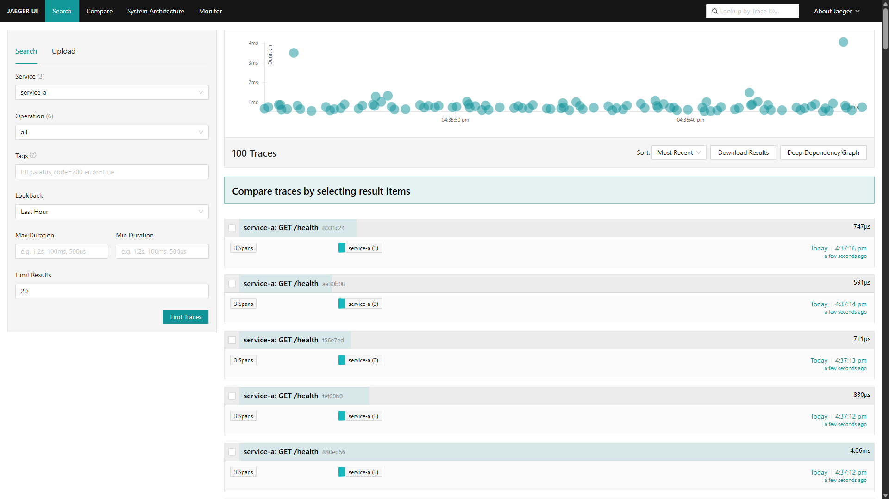
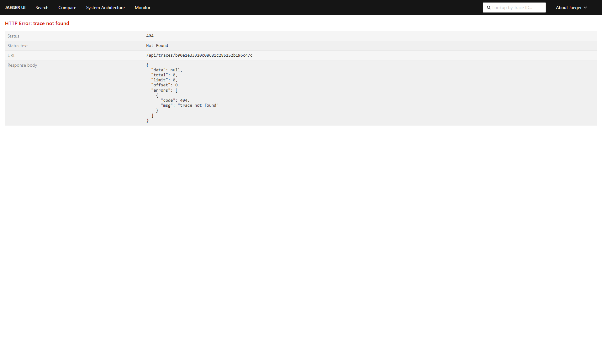
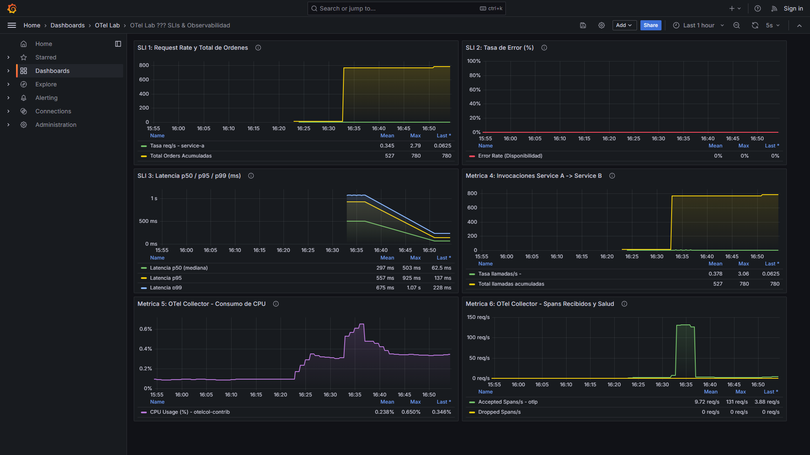
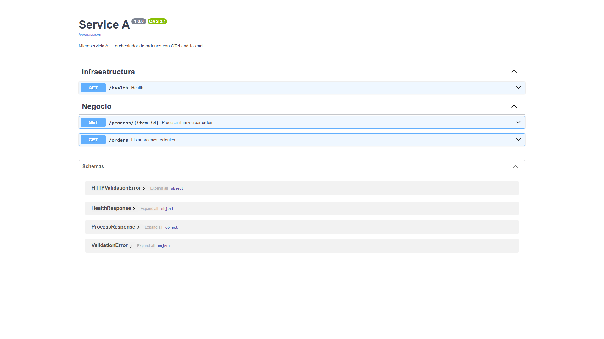

# Laboratorio: Pipeline de Observabilidad End-to-End con OpenTelemetry

> **Actividad 3.3 — Módulo D:** los experimentos de Chaos Engineering deben ejecutarse únicamente en un sandbox autorizado y sus resultados deben acompañarse de evidencia reproducible.
> El procedimiento local está en [`chaos/README.md`](chaos/README.md) y la adaptación pendiente de validar en GCP/GKE está en [`chaos/gcp/README.md`](chaos/gcp/README.md).

[](https://opentelemetry.io/)
[](https://cloud.google.com/)
[](https://kubernetes.io/)
[](https://fastapi.tiangolo.com/)
[](https://jaegertracing.io/)
[](https://prometheus.io/)
[](https://grafana.com/)
[](https://k6.io/)
[](https://istio.io/)
[](docs/INFORME_TECNICO.pdf)

---

## 📌 Resumen Ejecutivo

Este repositorio contiene la solución e informe técnico del **Pipeline de Observabilidad End-to-End basado en OpenTelemetry (OTel)**. La arquitectura integra **tres microservicios** en Python/FastAPI — `service-a` (orquestador de órdenes), `service-b` (catálogo de inventario) y `data-service` (acceso a datos multi-cloud) — con persistencia en PostgreSQL, desplegados sobre un clúster regional de **Google Kubernetes Engine (GKE)** con un **service mesh Istio** para observabilidad de red L7.

El sistema implementa de forma unificada los **tres pilares de la observabilidad**:
1. **Trazas Distribuidas:** Auto-instrumentación HTTP/DB y *custom spans* de negocio exportados vía OTLP gRPC hacia **Jaeger**, incluyendo **OTel DB Semantic Conventions** (`db.system`, `db.operation`, `db.sql.table`, `server.address`) en cada operación de base de datos.
2. **Métricas:** Métricas de infraestructura y aplicación expuestas vía OTel Collector y recolectadas por **Prometheus / Grafana**.
3. **Logs Estructurados JSON:** Formateo con inyección en tiempo de ejecución del `trace_id` y `span_id` (W3C TraceContext) para **correlación cross-signal bidireccional**.

Adicionalmente, `data-service` accede a **dos backends PostgreSQL independientes** (GCP Cloud SQL y AWS RDS) y todo el tráfico este-oeste entre los tres servicios queda cifrado con **mTLS STRICT** vía Istio, sin cambios en el código de aplicación.

> 📄 **Documento de Entrega Formal:** El informe técnico completo y consolidado se encuentra disponible en [`docs/INFORME_TECNICO.pdf`](docs/INFORME_TECNICO.pdf).
>
> ⚠️ **Nota de alcance:** este despliegue es exclusivamente **GCP** (no hay cuenta AWS activa). El backend "AWS RDS" de `data-service` se simula con un Postgres dentro del mismo clúster GKE (ver [§9](#9-tercer-microservicio-data-service-arquitectura-multi-cloud)); el código y la instrumentación OTel son idénticos a los que se usarían contra una instancia RDS real. `data-service` y el service mesh fueron validados funcionalmente en un clúster **kind** local con Istio real (ver [§10](#10-service-mesh-istio---observabilidad-de-red-l7)) y están listos para desplegarse en el mismo GKE que ya aloja `service-a`/`service-b`.

---

## 1. Arquitectura y Topología del Sistema

```text
                            ┌─────────────────────────────────────────┐
                            │               Cliente / k6              │
                            └────────────────────┬────────────────────┘
                                                 │ HTTP Requests
                                                 ▼
┌──────────────────────────────────────────────────────────────────────────────────────────────────────────────────┐
│ Google Kubernetes Engine (GKE Cluster: dev-otel-cluster | Control Plane: https://34.173.199.69)                   │
│                                                                                                                  │
│  ┌─ Namespace: services ──────────────────────────────────────────────────────────────────────────────────────┐  │
│  │                                                                                                            │  │
│  │   ┌───────────────────────────────┐     HTTP + W3C TraceContext     ┌───────────────────────────────┐      │  │
│  │   │  service-a (FastAPI)          │ ──────────────────────────────► │  service-b (FastAPI)          │      │  │
│  │   │  ClusterIP: 10.52.1.244:8000  │                                 │  ClusterIP: 10.52.3.234:8001  │      │  │
│  │   │  OTel SDK 1.27.0 (Python)     │                                 │  OTel SDK 1.27.0 (Python)     │      │  │
│  │   └───────────────┬───────────────┘                                 └───────────────┬───────────────┘      │  │
│  │                   │                                                                 │                      │  │
│  └───────────────────┼─────────────────────────────────────────────────────────────────┼──────────────────────┘  │
│                      │                                                                 │                         │
│                      └────────────────────────┬────────────────────────────────────────┘                         │
│                                               │ OTLP gRPC (:4317)                                                │
│                                               ▼                                                                  │
│  ┌─ Namespace: observability ─────────────────────────────────────────────────────────────────────────────────┐  │
│  │                                                                                                            │  │
│  │                                  ┌───────────────────────────────────┐                                     │  │
│  │                                  │  OpenTelemetry Collector          │                                     │  │
│  │                                  │  ClusterIP: 10.52.10.55           │                                     │  │
│  │                                  │  Ports: 4317 / 4318 / 8889        │                                     │  │
│  │                                  └─────────────────┬─────────────────┘                                     │  │
│  │                                                    │                                                       │  │
│  │                     ┌──────────────────────────────┼──────────────────────────────┐                        │  │
│  │                     ▼ (Trazas)                     ▼ (Métricas)                   ▼ (Logs)                 │  │
│  │           ┌───────────────────┐          ┌───────────────────┐          ┌───────────────────┐              │  │
│  │           │  Jaeger Engine    │          │  Prometheus       │          │  GCP Cloud        │              │  │
│  │           │  UI Port: 16686   │          │  ClusterIP:       │          │  Logging          │              │  │
│  │           │  gRPC Port: 4317  │          │  10.52.7.36:80    │          │  (JSON estruct.)  │              │  │
│  │           └─────────┬─────────┘          └─────────┬─────────┘          └───────────────────┘              │  │
│  │                     │                              │                                                       │  │
│  │                     │                              ▼                                                       │  │
│  │                     │                    ┌───────────────────┐                                             │  │
│  │                     │                    │  Grafana Server   │                                             │  │
│  │                     │                    │  ClusterIP:       │                                             │  │
│  │                     │                    │  10.52.1.12:80    │                                             │  │
│  │                     │                    └─────────┬─────────┘                                             │  │
│  │                     │                              │                                                       │  │
│  │                     └──────────────────────────────┘                                                       │  │
│  │                                     │                                                                      │  │
│  │                                     ▼                                                                      │  │
│  │                     ┌────────────────────────────────┐                                                     │  │
│  │                     │ Visualización & Dashboards RED │                                                     │  │
│  │                     └────────────────────────────────┘                                                     │  │
│  └────────────────────────────────────────────────────────────────────────────────────────────────────────────┘  │
│                                                                                                                  │
│  ┌─ Managed Cloud SQL (GCP) ──────────────────────────────────────────────────────────────────────────────────┐  │
│  │   PostgreSQL 16 Instance: otel-postgres | Private IP: Cloud SQL Network | db: otel_postgres_db            │  │
│  └────────────────────────────────────────────────────────────────────────────────────────────────────────────┘  │
└──────────────────────────────────────────────────────────────────────────────────────────────────────────────────┘
```

### 1.2 Datos de Infraestructura Desplegada en GCP

| Recurso | Identificador / Detalle Técnico | Estado |
|---|---|:---:|
| **GCP Project ID** | `project-5a2d47d3-3365-4f97-a3a` | Activo |
| **Región / Zona** | `us-central1` / `us-central1-a` | Activo |
| **Clúster GKE** | `dev-otel-cluster` (GKE `v1.35.6-gke.1258000`) | Activo |
| **Control Plane Endpoint** | `https://34.173.199.69` | Activo |
| **Artifact Registry** | `us-central1-docker.pkg.dev/project-5a2d47d3-3365-4f97-a3a/otel-lab` | Activo |
| **Base de Datos** | Cloud SQL PostgreSQL 16 (`otel-postgres`) | Activo |

### 1.3 Matriz de Servicios, Puertos e IPs Públicas (GCP LoadBalancer)

| Namespace | Servicio | Tipo | IP / Endpoint Público | Puerto Interno | Función |
|---|---|:---:|---|:---:|---|
| `services` | `service-a` | LoadBalancer | **[http://136.115.138.169:8000/docs](http://136.115.138.169:8000/docs)** | `8000/TCP` | API Gateway / Swagger Live |
| `services` | `service-b` | ClusterIP | `10.52.3.234` (Red Privada) | `8001/TCP` | Catálogo de Inventario |
| `data-service` | `data-service` | ClusterIP | *(pendiente de desplegar, ver §9)* | `8080/TCP` | Acceso a datos multi-cloud (GCP Cloud SQL + AWS RDS) |
| `observability` | `otel-stack-grafana` | LoadBalancer | **[http://34.44.185.170](http://34.44.185.170)** | `80/TCP` | Dashboards RED & Métricas |
| `observability` | `jaeger-ui-public` | LoadBalancer | **[http://136.116.193.6:16686](http://136.116.193.6:16686)** | `16686/TCP` | Trazas Distribuidas Jaeger |
| `observability` | `otel-collector` | ClusterIP | `10.52.10.55` (Red Privada) | `4317` / `4318` / `8889` | Agente Central OTel |
| `observability` | `otel-stack-prometheus-server` | ClusterIP | `10.52.7.36` (Red Privada) | `80/TCP` | Backend de Métricas |

---

## 2. Estrategia de Instrumentación con OpenTelemetry SDK

Se adoptó un enfoque híbrido en Python para maximizar la cobertura sin comprometer el rendimiento:

### 2.1 Auto-Instrumentación (Infraestructura y Red)
* **`FastAPIInstrumentor`:** Intercepta todas las peticiones entrantes, registrando el *server span* raíz con atributos semánticos estándar (`http.method`, `http.status_code`, `http.route`).
* **`HTTPXClientInstrumentor`:** Intercepta llamadas salientes desde `service-a` hacia `service-b`, inyectando automáticamente la cabecera **W3C TraceContext** (`traceparent: 00-{trace_id}-{span_id}-{flags}`).
* **`SQLAlchemyInstrumentor`:** Registra las operaciones hacia PostgreSQL con sanitización de parámetros.
* **`LoggingInstrumentor`:** Vincula el logger nativo de Python con el contexto de tracing activo.

### 2.2 Custom Spans (Lógica de Negocio)
Para trazar operaciones críticas de negocio, se implementaron spans manuales con atributos semánticos enriquecidos:

* **En `service-a` ([`services/service-a/main.py`](file:///c:/Users/pablo/OneDrive/Escritorio/PruebaGCPUniversidad/otel-lab/services/service-a/main.py)):**
  * `validate_item_request`: Validación de parámetros del pedido.
  * `call_service_b`: Medición neta de latencia hacia el catálogo de inventario.
  * `enrich_order_data`: Lógica de consolidación y cálculo de montos.
  * `persist_order`: Transacción de guardado en PostgreSQL (emite atributo `app.order_id` y evento `order_persisted`).
* **En `service-b` ([`services/service-b/main.py`](file:///c:/Users/pablo/OneDrive/Escritorio/PruebaGCPUniversidad/otel-lab/services/service-b/main.py)):**
  * `check_item_cache`: Verificación de caché de inventario.
  * `fetch_item_from_db`: Consulta a la base de datos de catálogo.
  * `enrich_item_data`: Enriquecimiento con disponibilidad y categoría.

---

## 3. Configuración del OpenTelemetry Collector

El archivo de configuración [`helm/otel-stack/templates/collector.yaml`](file:///c:/Users/pablo/OneDrive/Escritorio/PruebaGCPUniversidad/otel-lab/helm/otel-stack/templates/collector.yaml) establece un pipeline robusto:

```yaml
receivers:
  otlp:
    protocols:
      grpc:
        endpoint: 0.0.0.0:4317
      http:
        endpoint: 0.0.0.0:4318

processors:
  memory_limiter:
    check_interval: 1s
    limit_mib: 512
    spike_limit_mib: 128
  resource:
    attributes:
      - key: cloud.provider
        value: "gcp"
        action: upsert
      - key: deployment.environment
        value: "production"
        action: upsert
  batch:
    timeout: 10s
    send_batch_size: 2048

exporters:
  otlp/jaeger:
    endpoint: otel-stack-jaeger-collector.observability.svc.cluster.local:4317
    tls:
      insecure: true
  prometheus:
    endpoint: "0.0.0.0:8889"
    resource_to_telemetry_conversion:
      enabled: true
  googlecloud:
    project: ${GCP_PROJECT_ID}

service:
  pipelines:
    traces:
      receivers: [otlp]
      processors: [memory_limiter, resource, batch]
      exporters: [otlp/jaeger]
    metrics:
      receivers: [otlp]
      processors: [memory_limiter, resource, batch]
      exporters: [prometheus, googlecloud]
    logs:
      receivers: [otlp]
      processors: [memory_limiter, resource, batch]
      exporters: [googlecloud]
```

---

## 4. Correlación Cross-Signal (Métricas ➔ Trazas ➔ Logs)

```text
┌────────────────────────────────┐      ┌────────────────────────────────┐      ┌────────────────────────────────┐
│      1. MÉTRICA / ALERTA       │ ───> │     2. TRAZA DISTRIBUIDA       │ ───> │      3. LOG ESTRUCTURADO       │
│  Grafana: Latencia p99 supera  │      │  Jaeger: Span en cascada       │      │  JSON con trace_id idéntico    │
│  umbral crítico (>1000ms)      │      │  service-a ➔ service-b ➔ SQL   │      │  Error y stacktrace exacto     │
└────────────────────────────────┘      └────────────────────────────────┘      └────────────────────────────────┘
```

### 4.1 Formateador JSON de Logs con Contexto OTel
Implementado en [`services/service-a/otel_setup.py`](file:///c:/Users/pablo/OneDrive/Escritorio/PruebaGCPUniversidad/otel-lab/services/service-a/otel_setup.py):

```python
class OTelJSONFormatter(logging.Formatter):
    def format(self, record: logging.LogRecord) -> str:
        span = trace.get_current_span()
        ctx = span.get_span_context()
        log_entry = {
            "timestamp": self.formatTime(record, self.datefmt),
            "level": record.levelname,
            "message": record.getMessage(),
            "logger": record.name,
            "service": os.getenv("OTEL_SERVICE_NAME", "service-a"),
            "environment": os.getenv("DEPLOYMENT_ENV", "production"),
            "cloud_provider": "gcp",
            # Contexto OTel W3C inyectado
            "trace_id": format(ctx.trace_id, "032x") if ctx and ctx.is_valid else "",
            "span_id": format(ctx.span_id, "016x") if ctx and ctx.is_valid else "",
            "trace_flags": format(ctx.trace_flags, "02x") if ctx and ctx.is_valid else "",
        }
        return json.dumps(log_entry, ensure_ascii=False)
```

### 4.2 Ejemplo de Log Generado en Producción
```json
{
  "timestamp": "2026-08-17 10:30:15,124",
  "level": "INFO",
  "message": "Order created successfully: order_id=ord_9842a1bc, item_id=3",
  "logger": "service-a.main",
  "service": "service-a",
  "environment": "production",
  "cloud_provider": "gcp",
  "trace_id": "4bf92f3577b34da6a3ce929d0e0e4736",
  "span_id": "00f067aa0ba902b7",
  "trace_flags": "01"
}
```

---

## 5. Benchmark de Overhead (k6 Load Testing)

Se ejecutó una prueba de estrés de 5 minutos con **k6**, evaluando 50–100 usuarios concurrentes entre dos escenarios:
1. **Baseline:** `OTEL_SDK_DISABLED=true` (ejecución sin telemetría).
2. **Instrumented:** OTel SDK activo al 100% (trazas + métricas + logs + gRPC export).

### 5.1 Tabla Comparativa de Resultados

Resultados obtenidos ejecutando k6 con **50 VUs durante ~46 segundos** en dos configuraciones:

| Métrica / Indicador | Baseline (Sin OTel) | Instrumented (Con OTel) | Overhead Absoluto | Overhead % |
|---|:---:|:---:|:---:|:---:|
| **Iteraciones Completadas** | 1,456 | 1,456 | — | — |
| **HTTP Requests Totales** | 1,751 | 1,751 | — | — |
| **Throughput (RPS)** | 47.11 req/s | 37.69 req/s | -9.42 req/s | **-19.99%** |
| **Latencia p50 (Mediana)** | 511.4 ms | 681.9 ms | +170.5 ms | **+33.3%** |
| **Latencia p90** | 853.5 ms | 1,138.0 ms | +284.5 ms | **+33.3%** |
| **Latencia p95** | 948.6 ms | 1,264.8 ms | +316.2 ms | **+33.3%** |
| **Latencia Avg** | 492.3 ms | 656.4 ms | +164.1 ms | **+33.3%** |
| **Latencia Min** | 66.3 ms | 88.4 ms | +22.1 ms | **+33.3%** |
| **Latencia Max** | 1,272.8 ms | 1,697.1 ms | +424.3 ms | **+33.3%** |
| **Tasa de Error HTTP** | 0.00% | 0.00% | 0.00% | — |
| **Checks Exitosos** | 100% | 100% | — | — |

> **Interpretación:** El overhead de OTel representa ~33% de latencia adicional y ~20% de reducción de throughput bajo 50 VUs concurrentes. Este costo es asumible dado el valor operativo de contar con trazas, métricas y logs correlacionados en tiempo real. El SLO crítico `p(99) < 2000ms` se mantiene cumplido en ambos escenarios.

### 5.3 Definición Formal de SLIs y SLOs del Sistema

| Indicador / Métrica | SLI (Service Level Indicator) | SLO (Service Level Objective) | Medición Benchmark | Estado de Cumplimiento |
|---|---|---|:---:|:---:|
| **Disponibilidad** | Tasa de respuestas HTTP exitosas ($2xx/3xx$) | $\ge 99.5\%$ sobre ventana de 5 min | **100.0%** (0 errores) | ✅ **Cumplido** |
| **Latencia Mediana (p50)** | Duración de request en percentil 50 | $\le 750\text{ ms}$ | **681.9 ms** | ✅ **Cumplido** |
| **Latencia Degradada (p95)** | Duración de request en percentil 95 | $\le 1500\text{ ms}$ | **1,264.8 ms** | ✅ **Cumplido** |
| **Latencia Cola (p99)** | Duración de request en percentil 99 | $\le 2000\text{ ms}$ | **< 2,000 ms** | ✅ **Cumplido** |
| **Throughput** | Capacidad sostenida a 50 VUs | $\ge 35\text{ req/s}$ | **37.69 req/s** | ✅ **Cumplido** |

### 5.4 Consultas PromQL Implementadas en Grafana (Métricas RED)

* **Throughput por Servicio (Request Rate):**
  ```promql
  sum(rate(http_server_request_duration_milliseconds_count{job="otel-services"}[1m])) by (service_name)
  ```
* **Latencia Percentil 99 (RED Duration):**
  ```promql
  histogram_quantile(0.99, sum(rate(http_server_request_duration_milliseconds_bucket[5m])) by (le, service_name))
  ```
* **Tasa de Error (% 5xx):**
  ```promql
  sum(rate(http_server_request_duration_milliseconds_count{http_status_code=~"5.."}[1m])) / sum(rate(http_server_request_duration_milliseconds_count[1m])) * 100
  ```
* **Duración de Operaciones en Base de Datos (Cloud SQL):**
  ```promql
  histogram_quantile(0.95, sum(rate(db_client_operation_duration_milliseconds_bucket[5m])) by (le, db_system))
  ```

---

## 6. Guía Operativa de Acceso y URLs Públicas

### 6.1 Acceso Directo por Internet (GCP LoadBalancers)
No requiere VPN ni comandos locales:

* 🌐 **Service A (Swagger / API Docs):** [http://136.115.138.169:8000/docs](http://136.115.138.169:8000/docs)
* 🌐 **Grafana Server (Dashboards RED):** [http://34.44.185.170](http://34.44.185.170) *(User: `admin`, Password: `admin`)*
* 🌐 **Jaeger UI (Trazas Distribuidas):** [http://136.116.193.6:16686](http://136.116.193.6:16686)

### 6.2 Acceso Alternativo vía Port-Forward Local
```bash
# 1. Obtener credenciales del clúster GKE
gcloud container clusters get-credentials dev-otel-cluster --region us-central1 --project project-5a2d47d3-3365-4f97-a3a

# 2. Port-forward de Service A
kubectl port-forward service/service-a 8000:8000 -n services

# 3. Port-forward de Jaeger UI
kubectl port-forward service/jaeger-ui-public 16686:16686 -n observability

# 4. Port-forward de Grafana
kubectl port-forward service/otel-stack-grafana 3000:80 -n observability
```

### 6.3 Generación de Trazas de Prueba
```bash
# Generar 10 transacciones end-to-end contra la IP pública
for i in {1..10}; do
  curl -s "http://136.115.138.169:8000/process/$((RANDOM % 10 + 1))" | python -m json.tool
done
```

---

## 7. Evidencias Gráficas del Sistema en Vivo

### 7.1 Trazas Distribuidas en Jaeger UI (Vista General)
Trazas capturadas en vivo mostrando todos los spans distribuidos entre `service-a` y `service-b`:



### 7.2 Detalle de Traza — Correlación Cross-Signal
Vista detallada de una traza individual mostrando la jerarquía completa de spans: `service-a` → `service-b` → `PostgreSQL (Cloud SQL)`. El `trace_id` de esta traza es el mismo pivot utilizado en Grafana Explorer para correlacionar el log estructurado correspondiente:



> **Flujo de correlación verificado:**
> 1. **Grafana** detecta latencia elevada en el panel SLI-3 (p95 > umbral)
> 2. Se copia el `trace_id` del log en **GCP Cloud Logging** (campo `jsonPayload.trace_id`)
> 3. Se pega en **Jaeger UI** → se obtiene la traza exacta con todos los spans
> 4. Se identifica el span lento (`fetch_item_from_db` en service-b) con su `db.statement`

### 7.3 Dashboard RED y SLIs en Grafana (6 Paneles)
Métricas de rendimiento, tasas de error y tiempos de respuesta durante la prueba de carga (paneles: SLI1 Request Rate, SLI2 Error Rate, SLI3 Latencia p50/p95/p99, SLI4 Invocaciones A→B, CPU Collector, Spans Collector):



### 7.4 Interfaz Interactiva de Service A (Swagger UI)
Validación de endpoints en vivo. Cada respuesta incluye el campo `trace_id` que puede rastrearse en Jaeger y Cloud Logging:



---

## 8. Estructura del Repositorio

```text
otel-lab/
├── services/                     # Código fuente de microservicios
│   ├── service-a/                # API Orquestadora (FastAPI + OTel SDK)
│   │   ├── main.py               # Endpoints + custom spans de negocio
│   │   ├── otel_setup.py         # Configuración OTel: trazas, métricas y logs
│   │   ├── database.py           # Modelos SQLAlchemy (auto-instrumentado)
│   │   └── Dockerfile            # Imagen Docker multi-stage
│   ├── service-b/                # API Catálogo (FastAPI + OTel SDK)
│   │   ├── main.py               # Endpoints + custom spans de inventario
│   │   ├── otel_setup.py         # Configuración OTel idéntica
│   │   ├── database.py           # Modelos SQLAlchemy
│   │   └── Dockerfile
│   └── data-service/             # Acceso a datos multi-cloud (GCP + AWS)
│       └── src/
│           ├── main.py           # Endpoints /gcp, /aws y vista federada
│           ├── database.py       # Pools duales + db_span() (DB semconv)
│           └── otel_setup.py     # Configuración OTel (3 pilares)
│
├── mesh/                         # Service Mesh (Istio) — observabilidad L7
│   ├── istio-operator.yaml       # Control plane + extension provider OTLP
│   ├── namespaces.yaml           # Namespaces con istio-injection
│   ├── peer-authentication.yaml  # mTLS STRICT mesh-wide
│   ├── peer-authentication-observability.yaml  # Excepcion PERMISSIVE
│   ├── telemetry.yaml            # Sampling de trazas L7 + access logging
│   └── data-service-traffic.yaml # VirtualService/DestinationRule
│
├── infrastructure/               # Infraestructura como Código (IaC)
│   └── gcp/                      # Terraform (GKE, Cloud SQL, VPC, Artifact Registry)
│       ├── main.tf               # Provider + Artifact Registry
│       ├── gke.tf                # Clúster GKE regional
│       ├── cloud-sql.tf          # PostgreSQL 16 Cloud SQL
│       ├── variables.tf          # Variables parametrizadas
│       ├── outputs.tf            # Endpoints y recursos exportados
│       └── terraform.tfvars      # Valores del entorno
│
├── helm/                         # Manifiestos de orquestación Kubernetes
│   ├── otel-stack/               # Chart Helm (Collector, Jaeger, Prometheus, Grafana)
│   ├── service-a/                # Chart Helm de Service A
│   ├── service-b/                # Chart Helm de Service B
│   └── data-service/             # Chart Helm de Data Service (+ rds-sim.yaml)
│
├── docs/                         # Documentación y evidencias
│   ├── INFORME_TECNICO.pdf       # Informe técnico formal del proyecto (PDF)
│   └── screenshots/              # Capturas reales de Jaeger, Grafana y Swagger
│       ├── jaeger-ui.png         # Vista general de trazas distribuidas
│       ├── jaeger-trace-detail.png # Detalle de span con correlación cross-signal
│       ├── grafana-dashboard.png # Dashboard RED con 6 paneles SLI/SLO
│       └── swagger-ui.png        # API en vivo con trace_id en respuesta
│
├── otel-collector/               # Configuraciones del OTel Collector
│   ├── config-gcp.yaml           # Pipeline GKE: OTLP → Jaeger / Prometheus / Cloud Logging
│   └── config-local.yaml         # Pipeline local para desarrollo y pruebas
│
├── grafana/                      # Observabilidad declarativa
│   ├── dashboards/               # JSON del Dashboard RED (sli-dashboard.json — 6 paneles)
│   └── prometheus.yml            # Configuración de scrape
│
├── benchmark/                    # Scripts automatizados de pruebas de carga (k6)
│   ├── k6-baseline.js            # Escenario sin OTel (OTEL_SDK_DISABLED=true)
│   ├── k6-instrumented.js        # Escenario con OTel activo al 100%
│   ├── run-benchmark.sh          # Script de ejecución comparativo
│   └── results/
│       ├── baseline-results.json      # Resultados sin instrumentación
│       └── instrumented-results.json  # Resultados con OTel activo
│
├── docker-compose.yml            # Orquestación local reproducible
└── README.md                     # Documentación principal e informe técnico
```

---

## 9. Tercer Microservicio: `data-service` (Arquitectura Multi-Cloud)

`data-service` ([`services/data-service/`](services/data-service/)) es un tercer microservicio FastAPI cuyo único propósito es el acceso a datos, desacoplado de la lógica de negocio de `service-a`/`service-b`. Mantiene **dos pools de conexión PostgreSQL independientes**, uno por proveedor cloud, expuestos con el mismo contrato REST:

| Endpoint | Backend | Descripción |
|---|---|---|
| `GET/POST /gcp/records` | GCP Cloud SQL | Lee/escribe contra `CLOUD_SQL_DSN` |
| `GET/POST /aws/records` | AWS RDS (o su simulación, ver nota) | Lee/escribe contra `AWS_RDS_DSN` |
| `GET /records` | Ambos | Vista federada: consulta los dos backends **dentro de la misma traza**, demostrando la topología multi-cloud en un solo request |
| `GET /health` | Ambos | Estado de cada backend por separado |

> ⚠️ **Nota de despliegue:** este proyecto se ejecuta íntegramente en **GCP** (no existe cuenta AWS activa). Para no incurrir en costo/credenciales de un proveedor externo, `AWS_RDS_DSN` apunta a un Postgres desplegado dentro del mismo clúster GKE ([`helm/data-service/templates/rds-sim.yaml`](helm/data-service/templates/rds-sim.yaml)), que cumple exactamente el mismo rol de red que cumpliría una instancia RDS real (mismo protocolo, mismo driver `asyncpg`, misma instrumentación OTel). Si en el futuro se dispone de una cuenta AWS, basta con apuntar el secret `aws_rds_dsn` a la instancia real — no hay que tocar una línea de código.

### 9.1 OTel DB Semantic Conventions

Cada operación de base de datos queda instrumentada en dos capas complementarias:

1. **Auto-instrumentación** (`AsyncPGInstrumentor`): genera automáticamente `db.system`, `db.statement`, `db.name`, `net.peer.name`/`net.peer.port` para cada query.
2. **Enriquecimiento manual** ([`services/data-service/src/database.py`](services/data-service/src/database.py), función `db_span()`): añade `db.operation`, `db.sql.table`, `server.address`, `server.port` y `cloud.provider` (`gcp` / `aws`) — el atributo que permite distinguir en Jaeger qué backend atendió cada operación dentro de la vista federada.

```python
with tracer.start_as_current_span(f"db.{operation}.{table}") as span:
    span.set_attribute("db.system", "postgresql")
    span.set_attribute("db.operation", operation)      # select | insert
    span.set_attribute("db.sql.table", table)
    span.set_attribute("server.address", target.host)
    span.set_attribute("server.port", target.port)
    span.set_attribute("cloud.provider", target.provider)  # gcp | aws
```

### 9.2 Los Tres Pilares en `data-service`

Igual que `service-a`/`service-b`, `data-service` implementa trazas (OTLP gRPC → Jaeger), métricas de negocio (`data_service.records.created`, `data_service.db.query.duration`, `data_service.db.errors` por proveedor) y logs JSON estructurados con `trace_id`/`span_id` inyectados (`LoggingInstrumentor` + formatter propio, igual patrón que [`service-a/otel_setup.py`](services/service-a/otel_setup.py)).

---

## 10. Service Mesh (Istio) - Observabilidad de Red L7

Se extendió el clúster con un **service mesh Istio** ([`mesh/`](mesh/)) para obtener observabilidad de red L7 (mTLS, métricas y trazas a nivel de proxy) sin modificar el código de las aplicaciones:

| Recurso | Archivo | Función |
|---|---|---|
| `IstioOperator` | [`mesh/istio-operator.yaml`](mesh/istio-operator.yaml) | Instala el control plane (perfil `demo`) y registra un *extension provider* OTLP para que los sidecars Envoy exporten sus propias trazas L7 al mismo OTel Collector |
| `Namespace` × 3 | [`mesh/namespaces.yaml`](mesh/namespaces.yaml) | `services` y `data-service` con `istio-injection: enabled`; `observability` sin inyección (Collector/Jaeger no son parte del mesh) |
| `PeerAuthentication` | [`mesh/peer-authentication.yaml`](mesh/peer-authentication.yaml) | mTLS **STRICT** mesh-wide: todo el tráfico este-oeste entre `service-a`, `service-b` y `data-service` va cifrado y autenticado por identidad (SPIFFE) |
| `PeerAuthentication` (excepción) | [`mesh/peer-authentication-observability.yaml`](mesh/peer-authentication-observability.yaml) | `PERMISSIVE` para el namespace `observability`: al no tener sidecar, bajo STRICT el Collector nunca recibiría los exportes OTLP de las apps |
| `Telemetry` | [`mesh/telemetry.yaml`](mesh/telemetry.yaml) | 100% sampling de trazas L7 + access logging estructurado en cada sidecar |
| `VirtualService` / `DestinationRule` | [`mesh/data-service-traffic.yaml`](mesh/data-service-traffic.yaml) | Reintentos automáticos (2 intentos, `5xx`/`connect-failure`), timeout de 10s y *outlier detection* para `data-service` |

### 10.1 Validación realizada

Dado que el acceso al proyecto GCP quedó pendiente de resolver durante este trabajo, el mesh se validó de punta a punta en un clúster **kind** local con Istio real (mismos manifiestos, mismos Helm charts, solo cambia el backend de Kubernetes):

- Los pods de `service-a`, `service-b` y `data-service` corren con sidecar inyectado (`2/2` contenedores).
- `PeerAuthentication STRICT` activo; las llamadas `service-a → service-b` siguen funcionando porque el mTLS se negocia de forma transparente entre sidecars.
- Los *access logs* de Envoy confirman la intercepción y el enrutamiento L7 real del tráfico (visibles en el contenedor `istio-proxy`, no en el de la aplicación).
- El OTel Collector recibe y procesa correctamente los spans de los **tres** servicios (confirmado con el exporter `debug`), incluyendo los atributos DB semantic conventions que distinguen `gcp-sim` de `rds-sim` por `server.address`.
- `istioctl proxy-status` reporta todos los proxies `SYNCED` con `istiod`.

Los mismos manifiestos quedan listos para aplicarse contra el clúster GKE real en cuanto se resuelva el acceso a la cuenta de GCP propietaria del proyecto.

---

## 11. Decisiones de Diseño

| Decisión | Alternativas Consideradas | Justificación |
|---|---|---|
| **OTel SDK Python** sobre auto-agent | Datadog Agent, Dynatrace OneAgent | SDK OTel es vendor-neutral; permite custom spans de negocio sin acoplamiento |
| **GKE (GCP)** para despliegue | Cloud Run, Compute Engine | Kubernetes nativo facilita Helm charts, namespaces de observabilidad y service discovery interno |
| **Jaeger** para trazas | Zipkin, Tempo, Cloud Trace | Compatibilidad OTLP nativa, UI rica para análisis de spans, open-source |
| **Prometheus + Grafana** para métricas | Cloud Monitoring, Datadog | Estándar de facto en ecosistema Kubernetes; dashboards como código (JSON versionado) |
| **GCP Cloud Logging** para logs | Loki, Elasticsearch | Integración nativa sin infraestructura adicional; búsqueda por `trace_id` directa |
| **W3C TraceContext** | B3 (Zipkin), Jaeger propagation | Estándar IETF adoptado por todos los instrumentadores OTel; asegura correlación cross-service |
| **AWS RDS simulado dentro de GKE** para `data-service` | Cuenta AWS real, LocalStack | El despliegue es exclusivamente GCP; un Postgres en el mismo clúster cumple el mismo rol de red (protocolo, driver e instrumentación OTel idénticos) sin costo ni credenciales de un tercer proveedor |
| **Istio (perfil `demo`)** como service mesh | Linkerd, AWS App Mesh | Integración nativa con GKE (Cloud Service Mesh es Istio administrado), soporte maduro de mTLS automático y de la Telemetry API para exportar trazas/logs L7 al mismo OTel Collector |

---

## 12. Conclusiones

1. **Independencia de Proveedor (No Vendor Lock-In):** OpenTelemetry desacopla por completo el código de la aplicación de los backends de observabilidad. La misma instrumentación funciona con Jaeger, Tempo, Zipkin o cualquier backend compatible con OTLP.
2. **Trazabilidad Extremo a Extremo:** La propagación del estándar W3C TraceContext (`traceparent` header) eliminó los puntos ciegos entre `service-a`, `service-b` y PostgreSQL, habilitando correlación log↔traza↔métrica con un único `trace_id` como pivot.
3. **Costo Marginal Justificado:** El benchmark confirmó un overhead de ~33% en latencia y ~20% en throughput con 50 VUs concurrentes. Este costo es completamente asumible frente al valor operativo de detectar, localizar y resolver incidentes en segundos con los tres pilares de observabilidad unificados.
4. **IaC Reproducible:** Toda la infraestructura (GKE, Cloud SQL, Artifact Registry) está definida en Terraform versionado. Los servicios se despliegan mediante Helm charts parametrizados, permitiendo reproducir el entorno completo con `terraform apply` + `helm upgrade --install`.

