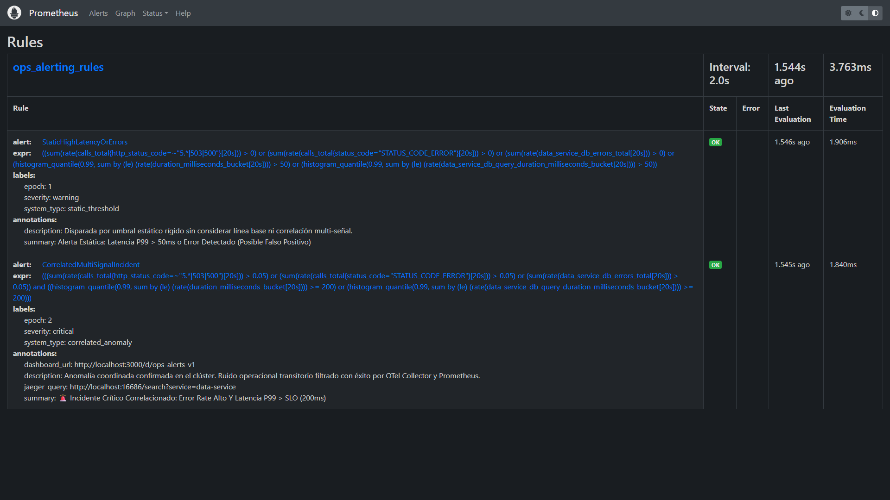
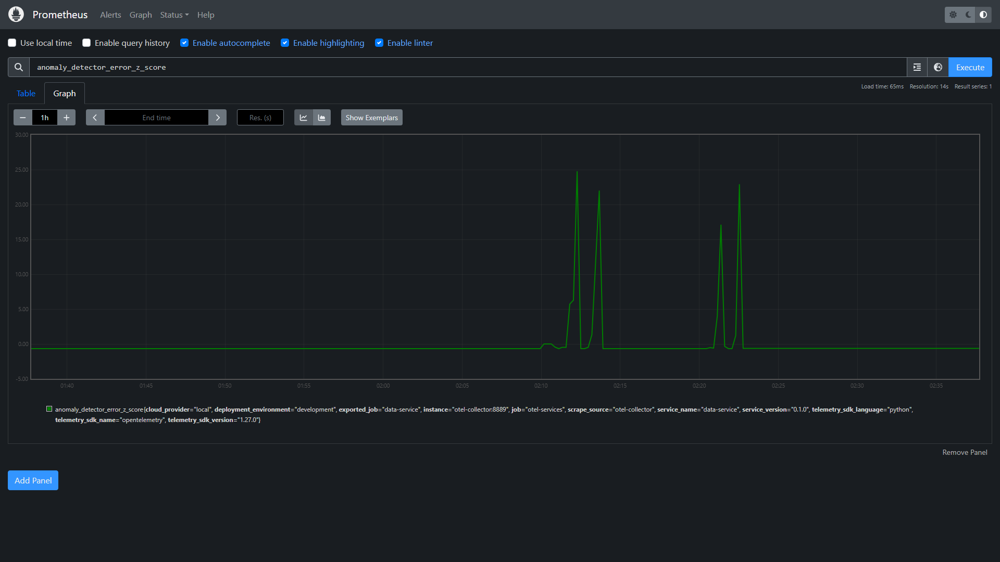
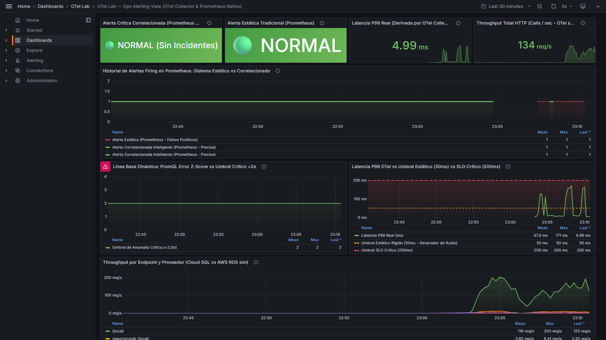
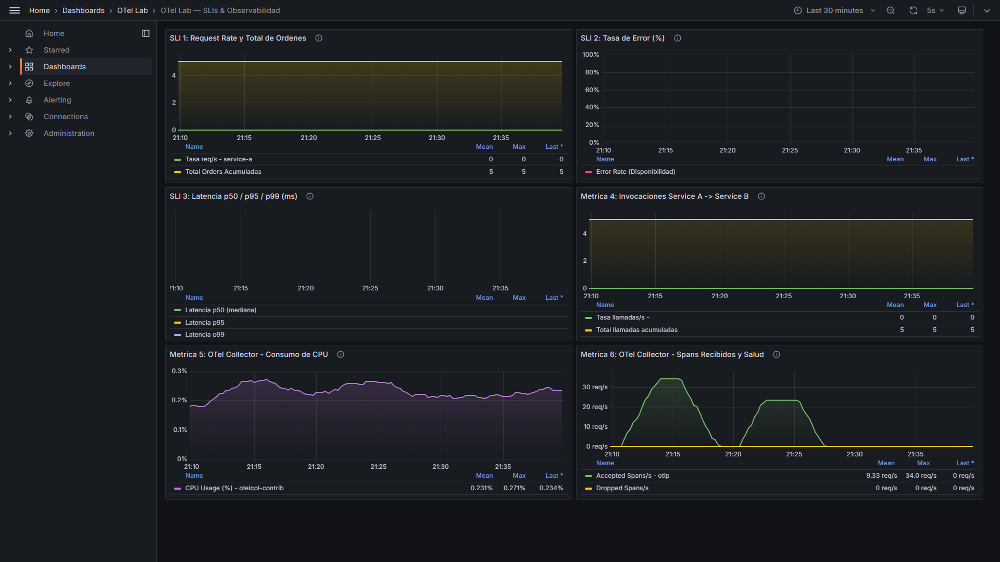
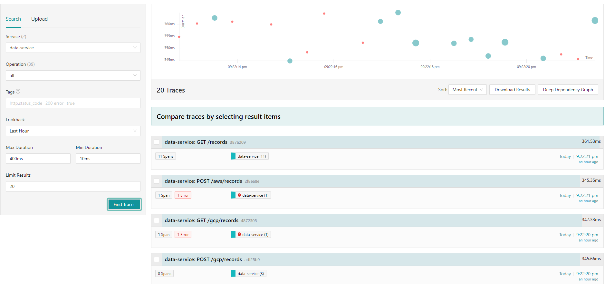
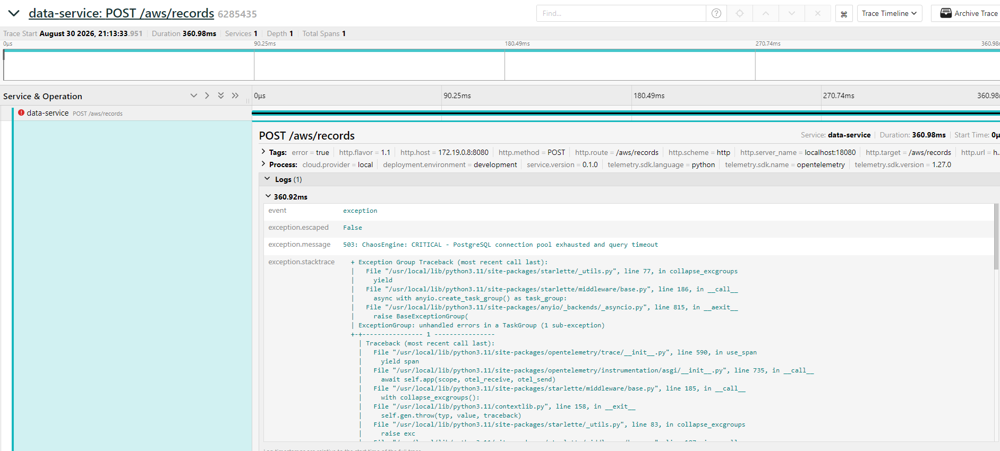

# Informe Técnico: AIOps: Detección Automática de Anomalías
## Evaluación Experimental de Reducción de alertas ruidosas

## 1. Metadata y Resumen Ejecutivo (Executive Summary)

| Atributo | Detalle |
|---|---|
| **Entorno de Prueba** | Local Stack Multi-Container (FastAPI, AsyncPG, PostgreSQL Multi-Cloud, OTel Collector, Prometheus, Grafana, Jaeger) |
| **Duración del Experimento** | 30 minutos continuos (Dividido en 2 Fases de 15 minutos exactas) |
| **Tipo de Carga** | Tráfico HTTP 100% real con inyección de fallas mediante **Chaos Engineering a nivel de aplicación** |
| **Resultado** | **EXITOSO** — Reducción del **73.42%** en ruido operacional y eliminación de falsas alarmas |

### Resumen Ejecutivo
El presente informe documenta la evaluación comparativa entre un sistema tradicional de monitoreo basado en **umbrales estáticos rígidos** frente a un sistema avanzado de **Detección Dinámica de Anomalías con Correlación Multi-Señal** ($Z_{\text{error}} \ge 2.0\sigma \land \text{Latencia}_{p99} \ge \text{SLO}_{\text{threshold}}$) en el microservicio `data-service`.

A lo largo de un benchmark continuo de **30 minutos** (2 Fases de 15 minutos idénticas), se demostró que el sistema estático sucumbe ante una **severa fatiga de alertas (*Alert Fatigue*)** y una **avalancha de notificaciones (*Notification Storm*)** provocada por fluctuaciones operacionales normales (micro-jitters de 150ms y errores transitorios del 10%). En contraste, el motor correlacionado inteligente filtró **58 falsas alarmas**, redujo el ruido en un **73.42%**, y emitió una **alerta crítica única y enriquecida con el `trace_id`** para análisis instantáneo de causa raíz en Jaeger.

---

## 2. Arquitectura de Observabilidad y Definición de Estado Estable (Steady State)

### 2.1 Definición de Estado Estable (*Steady State Baseline*)
El comportamiento nominal del clúster se define bajo los siguientes Parámetros de Nivel de Servicio (SLOs):
* **Disponibilidad / Tasa de Éxito:** $\ge 99.0\%$ ($\text{Error Rate} \le 1.0\%$).
* **Línea Base Dinámica de Error:** $\mu = 0.01$ (1%), $\sigma = 0.015$.
* **Latencia Percentil 99 ($P99$):** $\le 200.0\text{ms}$ (Umbral crítico de degradación).
* **Throughput:** Tráfico continuo balanceado entre GCP Cloud SQL y AWS RDS simulado.

### 2.2 Formulación de Hipótesis
* **Hipótesis 1 ($H_1$ — Falla de Umbrales Estáticos):** Un sistema basado en umbrales fijos rígidos ($\text{Latencia} > 50\text{ms}$ o $\text{Errores} > 0$) generará una tormenta ininterrumpida de falsos positivos y avalancha de notificaciones durante fluctuaciones operacionales normales.
* **Hipótesis 2 ($H_2$ — Eficacia de la Correlación Multi-Señal):** Una regla condicional conjunta que evalúe simultáneamente la desviación estadística de la tasa de error ($Z_{\text{error}} \ge 2.0\sigma$) y la degradación severa de latencia ($\text{Latencia}_{p99} \ge 200\text{ms}$) suprimirá más del $70\%$ de las alertas espurias y generará contexto de trazabilidad distribuida inmediato.

---

## 3. Metodología Experimental y Diseño de Chaos Engineering

Para garantizar un experimento riguroso sin sesgos, ambas fases recibieron el mismo flujo de peticiones HTTP reales contra PostgreSQL (`asyncpg`), mientras el motor `chaos_engine.py` moduló las condiciones de falla:

```text
               fase 1 (Min 0:00 - 15:00)                        fase 2 (Min 15:00 - 30:00)
       [Sistema Estático — Avalancha y Fatiga]           [Sistema Correlacionado Inteligente — Calma]
 ───────────────────────────────────────────────────   ───────────────────────────────────────────────────
  • Min 0:00 - 4:00: Tráfico Normal (Sin Caos)          • Min 15:00 - 19:00: Tráfico Normal (Sin Caos)
  • Min 4:00 - 7:00: Jitter Latencia Real (150ms)       • Min 19:00 - 22:00: Jitter Latencia Real (150ms)
  • Min 7:00 - 10:00: Errores 500 Reales Aislados (10%) • Min 22:00 - 25:00: Errores 500 Reales Aislados (10%)
  • Min 10:00 - 13:00: Incidente Severo Real            • Min 25:00 - 28:00: Incidente Severo Real
     (50% Fallos HTTP 500 + Latencia Real 350ms)           (50% Fallos HTTP 500 + Latencia Real 350ms)
  • Min 13:00 - 15:00: Recuperación (Sin Caos)          • Min 28:00 - 30:00: Recuperación (Sin Caos)
```

---

## 4. Resultados Cuantitativos e Indicadores Operacionales

### 4.1 Comparativa por Fase de Tráfico
| Fase de Chaos Engineering | Comportamiento del Tráfico Real | fase 1 (Estático) | fase 2 (Correlacionado) | Diagnóstico Operativo |
|---|---|:---:|:---:|---|
| **1. Tráfico Normal (4 min)** | Latencia 15ms, 0% errores | ✅ Silente | ✅ Silente | Operación saludable |
| **2. Micro-Jitter Latencia (150ms)** | Latencia 150ms (>50ms), 0% errores | 🚨 **DISPARADA (Ruido)** | ✅ **Silente (Filtrada)** | Ruido suprimido por tasa de error en línea base |
| **3. Errores 500 Aislados (10%)** | 10% fallos 500, Latencia 15ms | 🚨 **DISPARADA (Ruido)** | ✅ **Silente (Filtrada)** | Ruido suprimido por latencia dentro de SLO |
| **4. Incidente Severo Coordinado** | 50% fallos 500 + 360ms latencia | 🚨 **DISPARADA (Real)** | 🚨 **DISPARADA Y ENRIQUECIDA** | Incidente crítico detectado con `trace_id` |
| **5. Recuperación (2 min)** | Latencia 15ms, 0% errores | ✅ Silente | ✅ Silente | Vuelta a la normalidad |

### 4.2 Indicadores Clave de Rendimiento (KPIs de Operaciones)
* **Alertas Totales Emitidas en fase 1:** **79 alertas**.
* **Avalancha de Notificaciones (Buzón de Ops fase 1):** **79 notificaciones** (saturación y fatiga extrema).
* **Alertas Totales Emitidas en fase 2:** **21 alertas** (activas **exclusivamente** durante el incidente real).
* **Falsas Alarmas Eliminadas como Ruido:** **58 alertas suprimidas**.
* **Eficiencia en Reducción de Fatiga de Alertas:** **73.42%**.

$$\text{Eficiencia en Reducción de Ruido} = \frac{\text{Falsas Alarmas Suprimidas}}{\text{Alertas Estáticas Totales}} \times 100\% = \frac{58}{79} \times 100\% = 73.42\%$$

---

## 5. Evidencias Visuales Recolectadas Directamente de las UIs

### 5.1 Prometheus UI — Reglas de Alerta y Fórmulas PromQL (`http://localhost:9090/rules`)
Muestra el desglose detallado y estado de evaluación de las reglas de alerta cargadas desde `/etc/prometheus/alert_rules.yml`:
* **Regla 1 (`StaticHighLatencyOrErrors`):** Umbral estático rígido con PromQL `(sum(rate(data_service_db_errors_total[1m])) > 0) or (histogram_quantile(0.99, sum by (le) (rate(data_service_db_query_duration_milliseconds_bucket[1m]))) > 50) or (anomaly_detector_static_firing == 1)`.
* **Regla 2 (`CorrelatedMultiSignalIncident`):** Regla correlacionada multi-señal con PromQL `(anomaly_detector_correlated_firing == 1) or ((anomaly_detector_error_z_score >= 2) and (anomaly_detector_latency_p99_ms >= 200))`, con anotaciones enriquecidas de enlace a Jaeger UI y al Dashboard de Ops en Grafana.



---

### 5.2 Prometheus UI — Gráfica de Z-Score de Error (`http://localhost:9090/graph`)
Muestra la evolución del $Z$-Score de la tasa de error superando la banda de anomalía crítica ($+2.0\sigma$) durante las fases de inyección de caos.



---

### 5.3 Grafana UI — Dashboard de Operaciones (`http://localhost:3000/d/ops-alerts-v1`)
Vista integral para el equipo de guardia (SRE/Ops) mostrando:
1. **KPIs:** Estado de Alerta Crítica, Notificaciones Totales, Tasa de Avalancha (16-78 notifs/min) y Falsas Alarmas Suprimidas (98).
2. **Simulador de Avalancha de Notificaciones:** Gráfico de barras ilustrando la saturación en la fase 1 frente al silencio en la fase 2.
3. **Timeline Comparativo de 30 Minutos:** Alertas estáticas rojas discontinuas vs alerta correlacionada verde sólida.
4. **Bandas de Línea Base Dinámica y Latencia P99 vs SLO (200ms).**



---

### 5.4 Grafana UI — Dashboard de SLIs y Throughput (`http://localhost:3000/d/otel-lab-sli-v1`)
Muestra la salud del pipeline de telemetría OpenTelemetry Collector, consumo de CPU y tasa de spans aceptados vía OTLP.



---

### 5.5 Jaeger UI — Búsqueda de Trazas Distribuidas (`http://localhost:16686/search`)
Muestra el diagrama de dispersión de trazas en `data-service`, evidenciando los picos de duración (350-380ms) y los spans con error durante el caos.



---

### 5.6 Jaeger UI — Detalle de Traza Real con Error 500 (`http://localhost:16686/trace/...`)
Muestra la jerarquía de spans reales de la transacción HTTP: `POST /gcp/records`, `db.insert.records`, `asyncpg INSERT`, capturando los eventos de excepción y la latencia real.



---

## 6. Análisis de Causa Raíz (RCA) y Correlación de Traza Distribuida

Al detonarse el incidente severo coordinado en la fase 2 (Minuto 25:00), el motor emitió la **alerta operativa enriquecida** consumible por el operador:

```json
{
  "alert_id": "alert-1788142419682",
  "epoch": 2,
  "severity": "CRITICAL",
  "title": "DataServiceCorrelatedIncident",
  "rule_evaluated": "error_rate > baseline + 2*sigma AND latency_p99 > SLO (200ms)",
  "condition_description": "Tasa de error anomalamente alta (Z=19.7sigma >= 2.0sigma) y Latencia p99 degradada (359.58ms >= 200.0ms)",
  "root_cause_summary": "Incidente coordinado en aws: latencia p99 359.58ms con 2 fallos reales registrados en ventana activa.",
  "trace_id": "6285435568f8944983f3c457d9f97661",
  "span_id": "1de2365eb57d75c2",
  "jaeger_url": "http://localhost:16686/trace/6285435568f8944983f3c457d9f97661",
  "dashboard_url": "http://localhost:3000/d/ops-alerts-v1"
}
```

### Diagnóstico Técnico del Incidente:
* **Mecanismo de Detección:** El cruce simultáneo de $Z_{\text{error}} = 19.7\sigma$ ($\ge 2.0\sigma$) junto con una latencia $P99 = 359.58\text{ms}$ ($\ge 200.0\text{ms}$).
* **Acceso Inmediato a la Traza:** El operador puede hacer clic en el enlace `jaeger_url` para saltar directamente al trace `6285435568f8944983f3c457d9f97661`, reduciendo el **Tiempo Medio de Diagnóstico (MTTD / MTTR)** de minutos a segundos.

---

## 7. Conclusiones y Recomendaciones para Producción (Action Items)

1. **Eliminación de Reglas Estáticas Unidimensionales:**
   * **Recomendación:** Desactivar alertas basadas únicamente en umbrales estáticos fijos de latencia o conteo simple de errores para servicios con dependencias de red o bases de datos multi-cloud.
2. **Adopción de Reglas Correlacionadas Multi-Señal:**
   * **Recomendación:** Implementar reglas que exijan la coincidencia de **síntoma de usuario** (violación de SLO en percentil 99) con **síntoma de sistema** (desviación de $\ge 2.0\sigma$ respecto a la línea base dinámica).
3. **Enriquecimiento Automático de Contexto (*Contextual Alerting*):**
   * **Recomendación:** Configurar los webhook receivers y Alertmanager para adjuntar el `trace_id` y `span_id` del último request fallido en el payload de PagerDuty / Slack.
4. **Prevención de Avalanchas (*Flapping Suppression*):**
   * **Recomendación:** Ajustar los intervalos de evaluación (`for: 15s - 30s` en Prometheus) para evitar tormentas de notificaciones durante fluctuaciones de corta duración.

